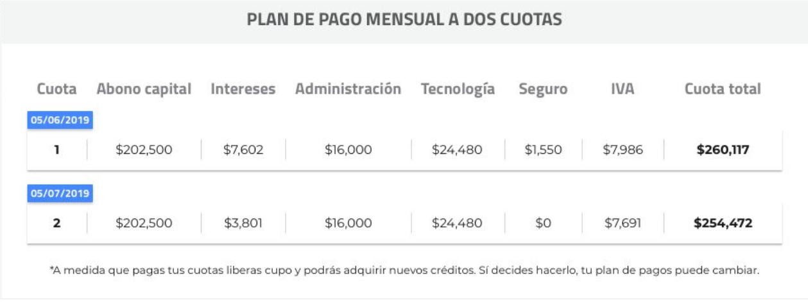
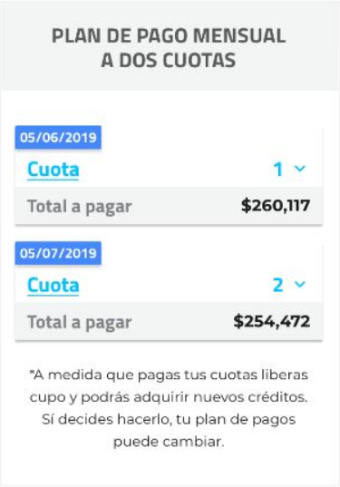
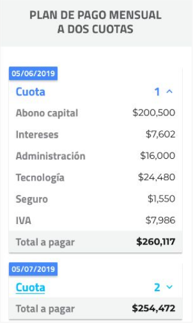

# Prueba técnica de maquetación para frontend developer

**Tiempo límite 2 horas**

Desarrolle la maquetación con html y css (no usar ningún framework como Bootstrap) de la siguiente imagen. Puede usar una librería externa de íconos si así lo requiere:

## Versión de escritorio

## Versión mobile

**Plus:** Que sea responsive y mobile first
